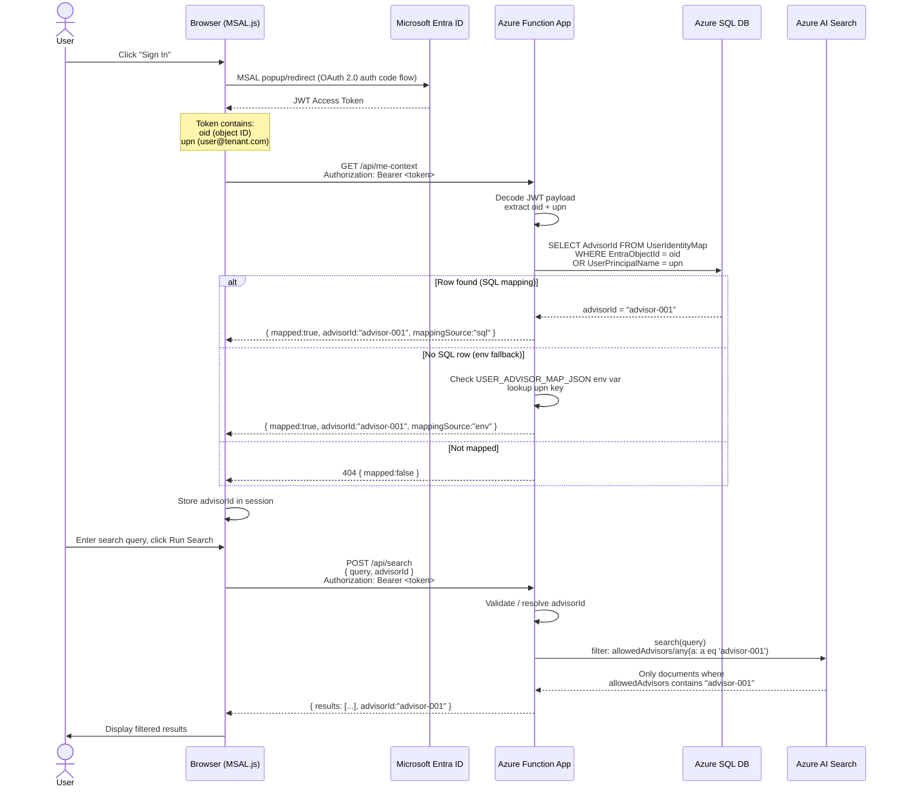

# Document Security Flow

This document explains the end-to-end security model: how a logged-in user's Microsoft Entra identity is resolved to an **advisor**, and how that advisor ID is used to enforce row-level access to documents in Azure AI Search.

---

## Architecture Overview

```
┌──────────────┐      MSAL Login       ┌─────────────────────┐
│   Browser    │ ─────────────────────▶ │  Microsoft Entra ID │
│  (MSAL.js)   │ ◀─────────────────────  │  (JWT Bearer Token) │
└──────┬───────┘   oid + upn claims     └─────────────────────┘
       │
       │  Bearer token on every API call
       ▼
┌──────────────────────────────────────────────────────────────┐
│                    Azure Function App                        │
│                                                              │
│  1. Decode JWT → extract oid, upn                           │
│  2. Query SQL UserIdentityMap → resolve advisorId           │
│  3. Apply OData filter to AI Search → allowedAdvisors       │
│                                                              │
└───────────┬──────────────────────────┬───────────────────────┘
            │                          │
            ▼                          ▼
   ┌─────────────────┐      ┌──────────────────────┐
   │   Azure SQL DB  │      │  Azure AI Search     │
   │ UserIdentityMap │      │ (index with          │
   │ Advisors        │      │  allowedAdvisors[])  │
   │ AdvisorClient   │      └──────────────────────┘
   │   Access        │
   └─────────────────┘
```

---

## Step-by-Step Flow

### Flow Diagram



---

## Key Components

### 1. MSAL Authentication (Browser)

File: [web/app.js](../web/app.js), [web/config.js](../web/config.js)

The browser uses **MSAL.js v2** to authenticate against Microsoft Entra ID. After sign-in, MSAL holds an access token scoped to the Function App's app registration (`api://<clientId>`).

Every API call attaches this token as an `Authorization: Bearer <token>` header.

```js
// config.js - scopes requested at login
scopes: ["api://90308e52-038b-41bd-8bb1-b69676502ae8/access_as_user"]
```

---

### 2. JWT Claim Extraction (Function App)

File: [src/function_app.py](../src/function_app.py) — `_get_identity_claims()`

The Function App **decodes the JWT payload** (Base64) to read two claims without performing signature verification (that is delegated to APIM):

| Claim | Field checked | Purpose |
|---|---|---|
| `oid` | Object ID | Stable, unique per-user identifier in Entra |
| `preferred_username` / `upn` / `email` | UPN | Human-readable fallback |

```python
def _get_identity_claims(req):
    token = req.headers.get('Authorization').split(' ')[1]
    payload = base64.urlsafe_b64decode(token.split('.')[1] + '==')
    claims = json.loads(payload)
    return {
        "oid": claims.get("oid") or claims.get("sub"),
        "upn": claims.get("preferred_username") or claims.get("upn") or claims.get("email")
    }
```

---

### 3. Identity → Advisor Mapping (SQL)

File: [src/shared/sql_client.py](../src/shared/sql_client.py) — `get_advisor_by_identity()`

The `UserIdentityMap` table is the core security bridge. It links an Entra identity to a business `advisorId`:

```sql
-- schema.sql
CREATE TABLE UserIdentityMap (
    Id                  INT PRIMARY KEY IDENTITY,
    EntraObjectId       NVARCHAR(64) NOT NULL UNIQUE,  -- Entra oid claim
    UserPrincipalName   NVARCHAR(255) NULL,             -- UPN for display / fallback
    AdvisorId           NVARCHAR(50) NOT NULL,          -- FK → Advisors.AdvisorId
    IsActive            BIT DEFAULT 1
);
```

The lookup query matches on **either** `oid` (preferred, stable) or `UPN` (case-insensitive fallback):

```sql
SELECT TOP 1
    uim.AdvisorId, a.FirstName, a.LastName, a.Email
FROM UserIdentityMap uim
LEFT JOIN Advisors a ON a.AdvisorId = uim.AdvisorId
WHERE uim.IsActive = 1
  AND (
       (? IS NOT NULL AND uim.EntraObjectId = ?)
    OR (? IS NOT NULL AND LOWER(uim.UserPrincipalName) = LOWER(?))
  )
```

The Function App connects to SQL using its **Managed Identity** — no passwords in config. The identity is granted `db_datareader` via:

```sql
-- grant_function_access.sql
CREATE USER [aisearch-demo-func-wyjsbl] FROM EXTERNAL PROVIDER;
ALTER ROLE db_datareader ADD MEMBER [aisearch-demo-func-wyjsbl];
```

---

### 4. Fallback: Environment Variable Map

File: [src/function_app.py](../src/function_app.py) — `_resolve_advisor_id()`, [web/config.js](../web/config.js)

If no SQL row exists for the user, a JSON string in the `USER_ADVISOR_MAP_JSON` app setting acts as a quick-demo fallback:

```json
{
  "test@MngEnvMCAP012775.onmicrosoft.com": "advisor-001",
  "testrlscls@MngEnvMCAP012775.onmicrosoft.com": "advisor-003",
  "advisor3@MngEnvMCAP012775.onmicrosoft.com": "advisor-010"
}
```

The browser has an equivalent `fallbackAdvisorMap` in `config.js` for the `/me-context` UI display.

> **Note:** The env fallback is for demo convenience only. Production should rely solely on the SQL table.

---

### 5. Row-Level Security in AI Search

File: [src/function_app.py](../src/function_app.py) — `search_func()`

Every indexed document has an `allowedAdvisors` field — a multi-value string collection listing the advisor IDs permitted to see it.

At query time, the Function App injects an **OData filter** that restricts results to only documents where the resolved advisor appears in that list:

```python
filter_expr = f"allowedAdvisors/any(a: a eq '{advisor_id}')"
search_results = search_client.search(
    search_text=query,
    filter=filter_expr,
    top=top_k
)
```

This means **Azure AI Search itself enforces the access boundary** — the Function App never receives documents the advisor cannot see. There is no post-query filtering needed.

Documents are indexed with advisor access set at upload time:

```json
{
  "id": "doc-001",
  "title": "Q1 Market Analysis",
  "allowedAdvisors": ["advisor-001", "advisor-002"],
  ...
}
```

---

### 6. Advisor → Client Access (Optional Deeper Layer)

File: [src/shared/sql_client.py](../src/shared/sql_client.py) — `get_allowed_clients()`

A second SQL table `AdvisorClientAccess` maps which **clients** each advisor manages. This can be used to further scope results to a specific client's documents:

```sql
SELECT c.ClientId
FROM AdvisorClientAccess aca
INNER JOIN Clients c ON aca.ClientId = c.Id
WHERE aca.AdvisorId = (SELECT Id FROM Advisors WHERE AdvisorId = ?)
  AND aca.IsActive = 1
```

---

## Security Decision Table

| Scenario | Result |
|---|---|
| User not logged in | Browser blocks API call; no token sent |
| User logged in, row in `UserIdentityMap` | Resolved via SQL → `mappingSource: "sql"` |
| User logged in, no SQL row, UPN in `USER_ADVISOR_MAP_JSON` | Resolved via env → `mappingSource: "env"` |
| User logged in, no mapping at all | `/api/me-context` returns 404 `mapped: false`; search blocked |
| Advisor requests document not in their `allowedAdvisors` | AI Search filter excludes it; never returned |
| Advisor passes a different `advisorId` in request body | Accepted only if explicitly provided; identity resolution overrides when body omits it |

---

## Adding a New User

### Option A — SQL (recommended for production)

Run against `aisearch-demo-sqldb`:

```sql
-- 1. Get the user's Entra Object ID from Azure Portal or:
--    az ad user show --id user@tenant.com --query id -o tsv

INSERT INTO UserIdentityMap (EntraObjectId, UserPrincipalName, AdvisorId, IsActive)
VALUES ('<entra-object-id>', 'user@tenant.com', 'advisor-001', 1);
```

Or use the incremental merge script at [data/sql/user_identity_map.sql](../data/sql/user_identity_map.sql).

### Option B — Environment Variable (demo only)

In the Azure Function App → Configuration → Application settings, edit `USER_ADVISOR_MAP_JSON`:

```json
{
  "user@tenant.com": "advisor-001"
}
```

---

## Diagnostic Endpoint

`GET /api/me-context?debug=1` (requires `ENABLE_IDENTITY_DEBUG=true` app setting)

Returns the full resolved identity context plus diagnostic fields:

```json
{
  "authenticated": true,
  "mapped": true,
  "mappingSource": "sql",
  "oid": "c62d90e2-...",
  "upn": "test@MngEnvMCAP012775.onmicrosoft.com",
  "advisorId": "advisor-001",
  "debug": {
    "identityLookupError": null,
    "claimsPresent": { "oid": true, "upn": true }
  }
}
```

Use this to diagnose mapping failures — `identityLookupError` will show any SQL exceptions, and `claimsPresent` confirms whether claims arrived in the token.
